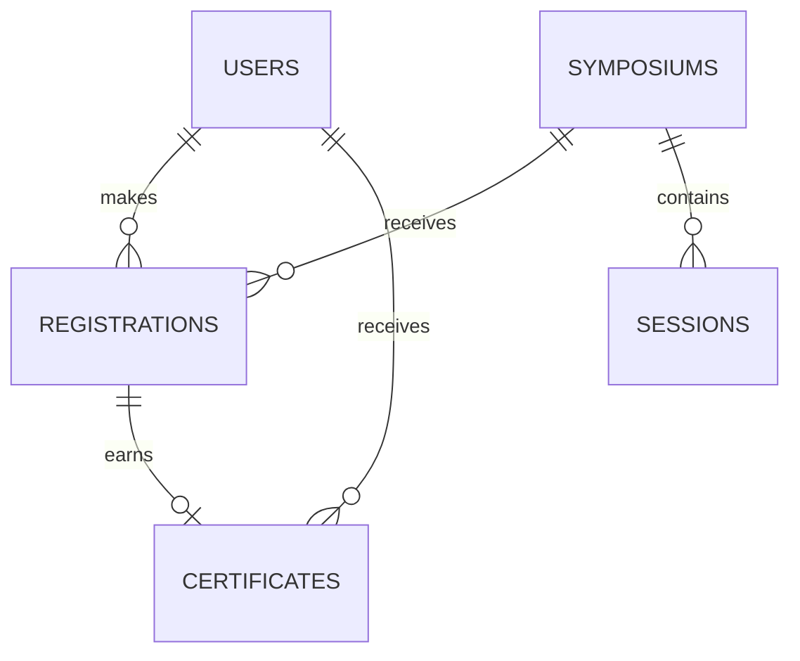
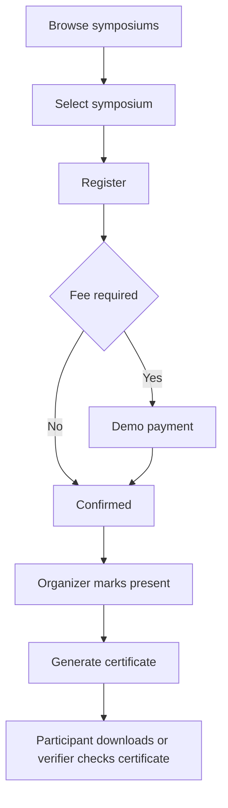

# SymposiHub Policy and Architecture Document

## 1 Title and objectives

SymposiHub reduces manual symposium administration by providing online registration, payment status tracking, attendance verification, certificate generation, download, and records management.

## 2 Expected outcome and stakeholders

The intended outcomes are online registration, automatic certificate generation for verified attendees, certificate downloads, and reduced administrative work. Stakeholders are participants, organizers, coordinators, and administrators.

## 3 Subjects objects and controls

| Subject | Permitted work | Objects | Controls |
| --- | --- | --- | --- |
| Participant | Register, pay, view status, download certificate | Profile, registration, certificate | Login, ownership checks, deadline/capacity checks |
| Organizer | Create events, track attendance, issue certificates | Symposium, session, attendance | RBAC and organizer ownership checks |
| Coordinator | Review proposals, monitor metrics | Symposium proposal, reports | RBAC approval rights |
| Administrator | Manage users, settings and logs | All system records | RBAC, audit logging, account activation |

## 4 Authentication mechanism

Passwords are stored with bcrypt. JWT sessions are kept in HTTP-only cookies. Optional TOTP MFA supports QR setup, backup codes, and a local email-OTP simulator. The client expires idle sessions after 30 minutes and shows an inactivity warning shortly before logout.

## 5 Authorization mechanism

Role-based access control limits each API route to participant, organizer, coordinator, or administrator privileges. Server routes enforce permissions; hiding a screen alone is not treated as authorization.

## 6 Accounting and session management

The application records login, registration, attendance, certificate, activity, and audit logs. Registrations follow: `registered -> pending payment/confirmed -> attended -> certificate issued`. A certificate is generated only when attendance is present.

## 7 CIA triad evaluation

- **Confidentiality:** HTTP-only JWT cookie, password hashing, MFA, RBAC, CORS, Helmet, and rate limiting protect access.
- **Integrity:** SQLite foreign keys, status validation, duplicate prevention, audit logs, and SHA-256 certificate hashes protect records.
- **Availability:** local seeded database, health endpoint, startup scripts, and retryable client API errors support normal operation. Production requires backups and monitoring.

## 8 Data dictionary and ER diagram

| Table | Key fields | Purpose |
| --- | --- | --- |
| users | id, name, email, password_hash, role | Accounts and roles |
| symposiums | id, title, dates, fee, capacity, status | Event catalogue and approval |
| sessions | id, symposium_id, title, start_time | Event programme |
| registrations | id, user_id, symposium_id, status, payment_status | Registration lifecycle and attendance |
| certificates | cert_uuid, user_id, symposium_id, integrity_hash | Verifiable certificate records |
| audit and accounting logs | actor/action/time/IP fields | Traceability and investigation |

## 9 Use cases and activity flow

The application pages expose these flows directly: catalogue/detail, participant portal, organizer attendance management, coordinator approvals, administrator controls, certificate verification, and the in-app documentation view.
